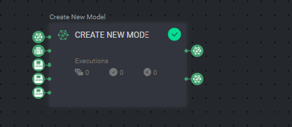

# Active Learning

Active learning is a method in machine learning that selects more informative data to label, prioritizing those
that would provide the most valuable information. By selectively labeling only informative examples, active learning
helps improve the learning process and achieve high accuracy with fewer labeled samples.


---

## Quick Start

1. Go to `Pipelines` and click `Create new pipeline`
2. Select the `Active Learning Pipeline` template
3. Click the pipeline variables icon [*X*] to enter the necessary IDs for each variable
4. After all the nodes are set up with variables, connections, or values, click `Start Pipeline` 

---

## Introduction

Dataloop pipelines provide a user-friendly interface for building, managing, and monitoring end-to-end machine learning
workflows. This Active Learning app installs custom nodes into Dataloop that allow you to implement active learning pipelines in production.

Custom nodes installed include:

- model data split
- create new models
- compare new model with previous model

Each node is explained in detail below.

---

## Model Data Split Node


The **Model Data Split** node is a data processing tool that enables you to split your data into subsets at runtime.
Use this to segment your ground truth into train, validation and test sets, simplifying the process.

Define the desired subsets distribution, and the Data Split node will assign each item to its
respective subset using metadata tags.

The tag will be a dictionary under `item.metadata.system.tags` with the format shown in the example below.

_Metadata for an item in the train subset:_
```json
{
  "system": {
    "tags": {
      "train": true
    }
  }
} 
```
To retrieve only the items from the `train` subset tagged in the above example, we use a DQL query to filter the dataset. The filters can be viewed here:

- [Train Subset Filter](pipeline_configs/train_subset_filter.json) 
- [Validation Subset Filter](pipeline_configs/validation_subset_filter.json)
- [Test Subset Filter](pipeline_configs/test_subset_filter.json)

---

## Create New Model Node



The **Create New Model** node generates a new model version by cloning an existing model, making it ready for
fine-tuning.

The node inputs can be provided using parameters (fixed values or dynamic variables) or through node connections. If a parameter is used in more than one node in the pipeline, it's recommended to use variables rather than fixed values.

Upon execution, the node will generate the new model and the original model as the output.

### Parameters

- `base_model` - this is a `dl.Model` entity
- `dataset` - this is the `dl.Dataset` entity that the model will train on
- `train_subset` - the DQL query for the subset of training items `Json` , see an [example](pipeline_configs/train_subset_filter.json)
- `validation_subset` - the DQL query for the subset of validation items `Json`, see an [example](pipeline_configs/validation_subset_filter.json)
- `model_configuration` - `Json` the model will use for training. this is the same as the "Model Configuration" from Model Management, and can be left empty to keep the original `base_model` configurations

### Outputs/returns

- `new_model` - the new model entity created `dl.Model`
- `base_model` - the base model entity used to clone the existing model `dl.Model`

---

## Compare Models Node


The **Compare Models** node makes a comparison between two trained model versions either based on the model metrics 
created during the training process, or based on the evaluation of each model using the same test set. To compare, _*both*_ models must have completed evaluation (see the pipeline image at the top of the page--the two
'Evaluate Model' nodes are included to ensure success).

The New Model input undergoes testing, and if it proves superior, it will be output under the action label `update model`,
signifying deployment readiness. Alternatively, it will be output under the action label `discard`.

### Parameters

- `previous_model` - the previously trained model `dl.Model`
- `new_model` - the newly trained model to compare with the previous `dl.Model`
- `compare_config` - the configurations for the comparison `Json` ([read more](#compare-configs) on setting up comparison configs)
- `dataset` - the dataset the models were evaluated on `dl.Dataset`

<a id="compare-configs"></a>
#### compare_configs:

- Config Example: [Compare config example](pipeline_configs/compare_configurations.json)

- **`precision_recall` (object)**: This subfield focuses on precision-recall metrics,
    the precision_recall comparison is based on the AUC-PR (Area Under the Curve - Precision-Recall) calculation, using the following criteria:
    - **`iou_threshold` (float)**: The Intersection over Union (IoU) threshold, which measures how much two sets of data
      overlap. It determines if a detected object matches a ground truth object. In the example above, it is
     **0.5**, meaning that any overlap exceeding 50% is considered a match.

    - **`min_delta` (float)**: The minimum difference allowed between precision-recall values. If the difference is
      less than this value, it may not be considered a significant change in performance.
    

Please note that as of the current version, only precision-recall metrics are supported. Additional metrics support may be added in future updates.

- If any other metrics are provided, they will be ignored.
- If precision recall is not provided, the default values will be used as shown in the [Example](pipeline_configs/compare_configurations.json).

### Outputs/returns

- `winning_model` - `dl.Model` - the node will output the ID for the "winning" model. The "winning" model is the one with better values for the specified metric, and will be output from one of the two actions below based on whether or not the winning model is the newly trained version.
  - `update_model` - if the new model is better than the previous model
  - `discard` - if the previous model performs better than the new model

---


## Contributions, Bugs and Issues - How to Contribute

We welcome your help to improve this app.  
[Here](CONTRIBUTING.md) are detailed instructions on how to open a bug or make a feature request.