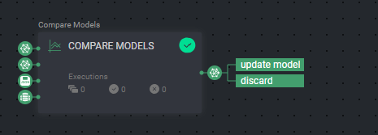

# Active Learning

Active learning is a method in machine learning that selects more informative data points to label, prioritizing those
that would provide the most valuable information. By selectively labeling only informative examples, active learning
helps improve learning process efficiency to achieve high accuracy with fewer labeled samples.


---

## Quick Start

* In order to continue, you need to install our &nbsp;🚀 &nbsp;[Python SDK](https://github.com/dataloop-ai/dtlpy) and
  use our [CLI](https://sdk-docs.dataloop.ai/en/latest/cli.html).

1. Go to `Pipelines` and `Create new pipeline`
2. Select the `Active Learning` template
3. Fill in the required inputs and outputs in each node
4. Start pipeline

---

## Introduction

Dataloop pipelines provides a user-friendly interface for building, managing, and monitoring end-to-end machine learning
workflows. This Active Learning app installs custom nodes into Dataloop pipelines to allow users to implement active
learning pipelines in production.

Custom nodes installed include:

- model data split
- create new models
- compare two models

Each node is explained in detail below.

---

## Model Data Split Node


The **Model Data Split** node is a data processing tool that empowers you to split your data into subsets at runtime.
Use this node to segment your ground truth into train, validation and test sets, simplifying the process.

Simply specify the desired subsets distribution, and the Data Split node will seamlessly assign each item to its
respective subset using metadata tags.

The tag will be added to a dictionary under `item.metadata.system.tags` in the following format:

**Item metadata in train Subset Example**
```json
{
  "system": {
    "tags": {
      "train": true
    }
  }
} 
```
Filter items in the train subset, use the following DQL query:

- [Train Subset Filter](pipeline_configs/train_subset_filter.json) 

---

## Create New Model Node


The **Create New Model** node generates a new model version by cloning an existing model, making it ready for
fine-tuning.

The node inputs can be provided using parameters (fixed values or dynamic variables) or through node connections.

Upon execution, the node will generate the new model as output. For more information, see our Active Learning
documentation.

### Parameters

- `base_model` - the model to clone `dl.Model`
- `dataset` - the dataset to train on `dl.Dataset`
- `train_subset` - the DQL query for the subset of training items `Json` [Example](pipeline_configs/train_subset_filter.json)
- `validation_subset` - the DQL query for the subset of validation items `Json` [Example](pipeline_configs/validation_subset_filter.json)
- `model_configuration` - the model configurations to use for training `Json`: Model Configuration from Model Management

### Outputs/returns

- `new_model` - the new model entity created `dl.Model`
- `base_model` - the base model entity used to clone existing model `dl.Model`

---

## Compare Models Node



The **Compare Models** node undertakes a comparison between two trained model versions based on their evaluation (same
test set) or the model metrics created during the train process.

The New model input undergoes testing, and if it proves superior, it will be sent as an output labelled `update model`,
signifying deployment readiness. Alternatively, it will be labelled `Discard`. For more information, see our Active
Learning documentation

### Parameters

- `previous_model` - the previously trained model `dl.Model`
- `new_model` - the newly trained model to compare with the previous `dl.Model`
- `compare_config` - the configurations for the comparison `Json` [Read more](#compare-configs)

- `dataset` - the dataset the models were evaluated on `dl.Dataset`

<a id="compare-configs"></a>
#### compare_configs:

- Config Example: [Compare config example](pipeline_configs/compare_configurations.json)

- **`precision_recall` (object)**: This subfield focuses on precision-recall metrics,
    the precision_recall comparison is based on the AUC-PR (Area Under the Curve - Precision-Recall) calculation, using the following criteria:
    - **`iou_threshold` (float)**: The Intersection over Union (IoU) threshold, which measures how much two sets of data
      overlap. It is used to determine if a detected object matches a ground truth object. In the example above, it is
      set to **0.5**, meaning that any overlap exceeding 50% is considered a match.

    - **`min_delta` (float)**: The minimum difference allowed between precision-recall values. If the difference is
      less than this value, it may not be considered a significant change in performance.
    

Please note that, as of the current version, only precision-recall metrics are supported in the section, Additional metric support may be added in future updates.

- If any other metrics are provided, they will be ignored.
- If precision recall is not provided, the default values will be used as shown in the [Example](pipeline_configs/compare_configurations.json).

### Outputs/returns

- `winning_model` - `dl.Model` - the model that wins the comparison, with two `action` fields: 
  - `update_model`
  - `discard`

---

## Contributions, Bugs and Issues - How to Contribute

We welcome anyone to help us improve this app.  
[Here's](CONTRIBUTING.md) a detailed instructions to help you open a bug or ask for a feature request.